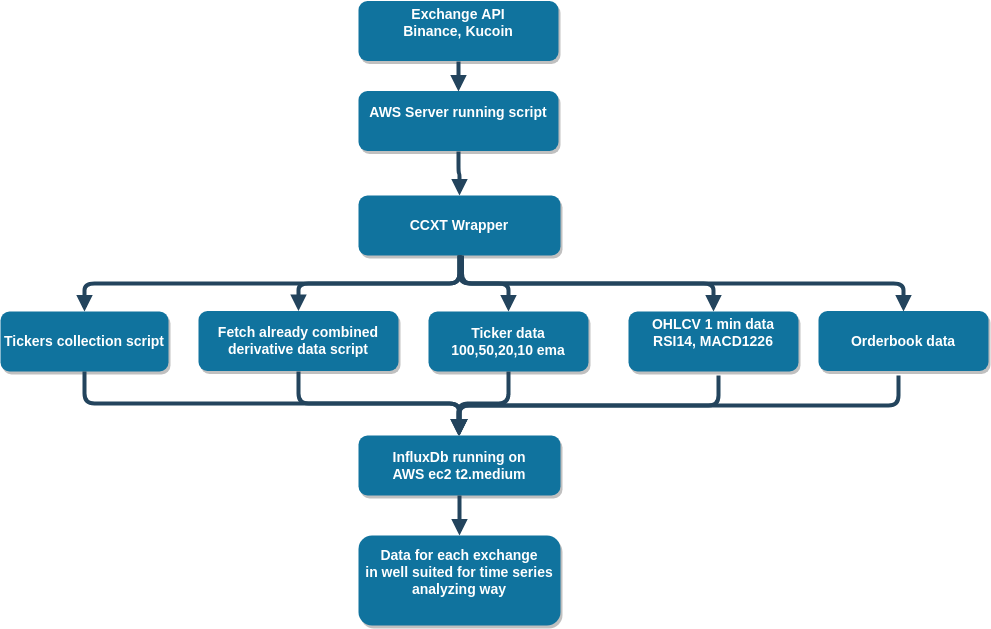

tkg-interfaces
=======================

###Description
With current developments in Cryptocurrency market, 
hot topic is applying deep learning models into trading and then predicting the price trends using those models and trading automatically with bots.

Deep learning is different than traditional machine learning and it is highly dependent on how much and how good your data is.

When we want to train a model using Python and Keras we will face the problem with data availability which we try to solve with this repo. 
Data collected is useful for all sorts of different uses. Not only predicting future price predictions, 
deep learning can also be used for uncovering the price changes between different exchanges, 
unrevealing arbitrage opportunities before it happens.




1. Use ccxt library to fetch data from Binance, Kucoin, ...
2. Store it in InfluxDB
3. Easily fetch it from InfluxDb as Pandas DataFrame for analyzing

###Installation
After clonning repository from git do next
```bash
cd tkg-interfaces
python3 -m pip install --upgrade pip 
python3 -m pip install -r requirements.txt
```

###Running
```bash
usage: runner.py [-h] -ft FETCHTYPE -ex EXCHANGE [-p PAUSE]

optional arguments:
  -h, --help            show this help message and exit
  -ft FETCHTYPE, --fetchtype FETCHTYPE
                        Fetch type. ticker = write tickers ob = orderbook
                        data(look orderbook class docstring) derivative =
                        write derivative data tickmas = to wite different
                        moving averages ohlcvind = to write indicators on
                        ohlcv candle data
  -ex EXCHANGE, --exchange EXCHANGE
                        Define exchange name in accordance to ccxt notation
  -p PAUSE, --pause PAUSE
                        Define pause between fetching in seconds. Default is
                        0.5
```
